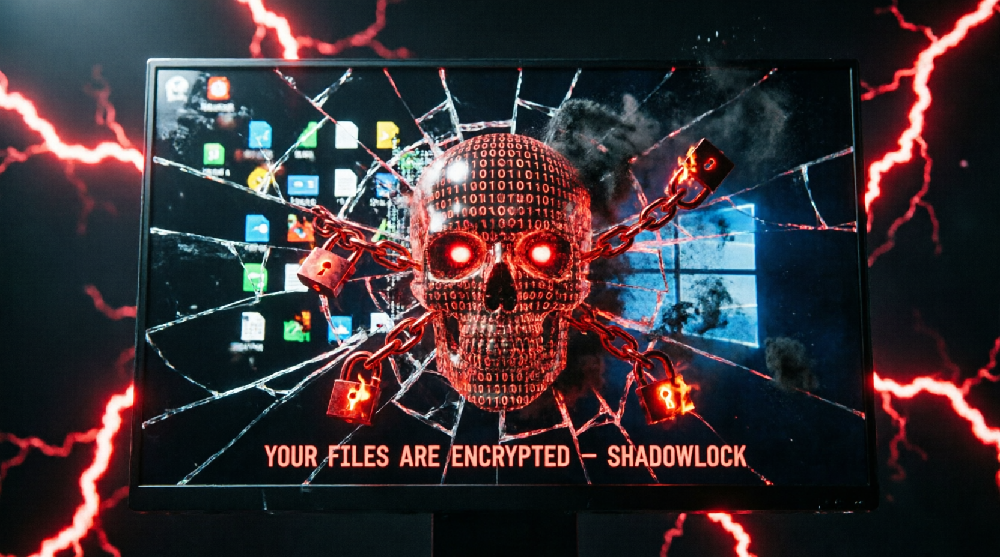

  
  <h1>⚡ ShadowLock – Next‑Gen Ransomware Framework</h1>
  <b>For security research & education only. Run inside an isolated VM.</b>
    
  
  
  

## 🔐 Features

- **Real AES‑256 encryption** (CBC mode, random IV)
- **Persistence** via Registry Run key + Startup folder
- **Anti‑debug & Anti‑VM** (simple checks)
- **Recursive encryption** of all drives (skips system dirs)
- **Ransom note** on desktop
- **Decryption** with correct password
- **Builder GUI** to customize message, password, email, extensions

## ⚠️ WARNING

This software is for **EDUCATIONAL PURPOSES ONLY**.  
Use it only in a virtual machine with dummy data.  
The author is not responsible for any damage or illegal use.

## 🛠️ How to Use

1. Open `Builder/ShadowLockBuilder.exe`
2. Configure ransom note, password, email, target extensions
3. Click **Build Payload** – generates `ShadowLock.exe`
4. Run `ShadowLock.exe` inside **Windows 10/11 VM** (as admin)
5. It will encrypt files in all user directories and drives
6. Decrypt by entering the correct password in the popup

## 🔬 Technical Analysis

- **Encryption**: AES-256-CBC + SHA256 key derivation (no salt for simplicity)
- **File extension**: `.shadow` appended
- **Persistence**: Adds itself to `HKCU\Software\Microsoft\Windows\CurrentVersion\Run` and copies to Startup folder
- **Anti‑analysis**: Checks for debugger and VM names (vbox, vmware)
- **Mutex**: Single instance enforcement

## 📸 Screenshot

## 🧪 Test Environment

- Windows 10 Pro (21H2) VM
- .NET Framework 4.8
- Disable Windows Defender temporarily (for testing only)

## 📄 License

MIT – feel free to modify for learning, but don't be evil.

## 👤 Author

BlackEvil518 – [GitHub](https://github.com/blackevil518)
